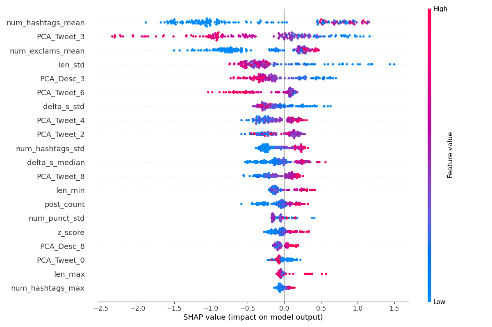

# 🤖 Bot-or-Not Challenge

A bot detection pipeline that uses semantic embeddings, tweet metadata, and an ensemble of XGBoost models to predict if you're-a-bot-or-if-you're-not! (Same pipeline for both English and French.)

## The Cool Parts

* **Semantic Variance (Embeddings):** I use `all-MiniLM-L6-v2`, a sentence transformer model, to turn tweets and user descriptions into vectors, then calculate the mean and standard deviation (for tweets) of these embeddings.
    * *The logic:* Humans are semantically chaotic (higher std dev because the same person can discuss varied topics in varied ways), whereas bots are repetitive and "templated" (lower std dev). Additionally, the Language Model can likely identify "human-centric" semantic signatures like conversational nuances and personal anecdotes that bots rarely replicate.
   * *Dimensionality reduction for embeddings:* I used **PCA** to compress 1,152 raw embedding dimensions (tweet mean/stdev and description single-value) into into 10 tweet features and 10 description features. This prevents the model from over-fitting to specific topics like "Crypto" or "Politics" and keeps the features topic-agnostic.
* **Council of 5:** I found it was better not to rely on one model (in k-fold validation, I found quite a lot of variation depending on the `random_state` used, given such a small training set). I train **5 XGBoost models** on different random seeds and average their votes.

## Results & Quick Analysis
Here's how a single model did, evaluated using 5-fold stratified cross-val. These values jumped around quite a bit depending on the `random_state` (here it's =2).

The model is still quite consistent, though. The `Profit Score` below is the bot-or-not challenge's internal scoring rules based on the true positives, false positives, and false negatives. Results below are on folds of 178 users.

| Fold | Profit Score | True Positives | False Positives | False Negatives |
| :--- | :--- | :--- | :--- | :--- |
| **1** | 127 | 34 | 3 | 3 |
| **2** | 137 | 36 | 3 | 1 |
| **3** | 126 | 33 | 1 | 4 |
| **4** | 132 | 35 | 3 | 2 |
| **5** | 124 | 34 | 5 | 2 |
| **AVG**| **129.2** | 34.4 | 3.0 | 2.4 |

## What makes a Bot a Bot?
I used SHAP (feature importance analysis) to look inside the XGBoost model and see exactly which features the model uses to convict a user.

#### **Main takeaways:**
1.  **Hashtag Spam (`num_hashtags_mean`):** The clearest signal. If the dots are blue (low hashtag count), the SHAP value is low (pushes prediction toward **Human**). Humans rarely use many hashtags.
2.  **"Human Vibe"? (`PCA_Tweet_3`):** This abstract feature from the embedding compression turns out to be important. High values (pink) strongly indicate **Human**, while low values (blue) indicate **Bot**. This suggests `PCA_Tweet_3` captures a specific semantic style (possibly conversational flow or "I" statements) that bots don't replicate.
3.  **More "Robot" Signatures (`num_exclams_mean` and `len_std`):**
    * **`num_exclams_mean`** Low numbers of exclamation marks (blue) push to the left, almost always corresponding to **Human**. Bots can't help but use exclamation marks!
    * **`len_std`** High deviation in tweet length (pink) pushes to the left, corresponding to **Human**. This is likely because Humans are chaotic and inconsistent (could go on long tangents or simple reply "agreed"), while Bots aren't.
4.  **Other PCA Features:** Many other abstract PCA features appear in the top 20. They're near-impossible to interpret individually, but their high rank confirms that *what* users talk about (semantics) is just as important as *how* they talk about it (metadata).
5.  **Time Gaps (`delta_s_median` and `delta_s_std`):**
    * **`delta_s_median`** High median time gaps (pink) in posting indicate **Bot**. This suggests bots operate on a "drip" schedule (like one post every hour), whereas humans tweet in rapid-fire bursts (resulting in tiny gaps).
    * **`delta_s_std`** High deviation (pink) indicates **Human**. Humans are more chaotic (binge-tweet during sports game then sleep), whereas bots often stick to a rigid schedule.

## How to Run

1.  **Extract Features**
    `python build_training_features.py`
    *(Converts raw JSONs into a Parquet file containing metadata and embeddings)*

2.  **Evaluate & Tune**
    `python cv_eval.py`
    *(Runs 5-fold Stratified Cross-Validation to find the best threshold for the challenge profit metric)*

3.  **Train the Council**
    `python train_final.py`
    *(Trains the 5-model ensemble on the full dataset and saves the `bot_detector_v1.pkl` artifact)*

4.  **Predict**
    `python predict.py`
    *(Takes the inference file defined in `config.py` and outputs `predicted_bot_ids.txt`)*

## Config

All paths and flags are managed in `botornot/config.py`:
* Toggle `USE_EMBEDDINGS` (Default: `True`)
* Update `INFERENCE_POST_FILES` with the target dataset.
* Adjust the classification `THRESHOLD` (Current optimal I've found: `0.45`).

---
*Built for the McGill Bot-or-Not Challenge.*